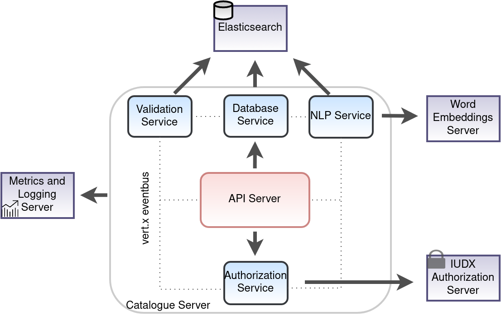

%20pipeline/lastBuild/)
%20pipeline/lastBuild/jacoco/)
%20pipeline/lastBuild/testReport/)
%20pipeline/lastBuild/performance/)
%20pipeline/lastBuild/zap/)
%20pipeline/lastBuild/Integration_20Test_20Report/)

# DX Catalogue Server
## Introduction
The catalogue is [DXs](https://iudx.org.in) data discovery and dataset metadata publishing portal.
It allows data providers to publish their data *resources* by making an IUDX vocabulary annotated meta-data document describing their datasource and affiliated terminologies.
The datasources publish their data to the IUDX *Resource Server*.
It allows consumers of such data to easily discover such *resources* by means of powerful
queries and consume the data from *Resource Servers* in an automated and machine interpretable way.

## Features
- Search and discovery of data resources hosted on IUDX platform
- Support for text, geo-spatial, relationship, list and attributes searches
- Upload, delete and modify operations on catalogue objects (meta-information corresponding to resources)
- Stores meta-information as JSON-LD documents using published vocabulary and attributes
- Rate and review data resources hosted on IUDX platform
- Scalable, service mesh architecture based implementation using open source components: Vert.X API framework, Elasticsearch for data-base
- Hazelcast and Zookeeper based cluster management and service discovery

## Live 
The live running instance of the IUDX catalogue can be found [here](https://catalogue.iudx.org.in).

# Explanation
## Understanding Onboarding Server
- The section available [here](./docs/Solution_Architecture.md) explains the components/services
  used in implementing the Onboarding Server.
- To try out the APIs, import the API collection, postman environment files in postman.
- Reference : [postman-collection](https://github.com/datakaveri/iudx-catalogue-server/blob/master/src/test/resources/iudx-catalogue-server-v5.5.0.postman_collection.json), [postman-environment](https://github.com/datakaveri/iudx-catalogue-server/blob/master/src/test/resources/CAT.postman_environmentv5.5.0.json)

# How to Guide
## Setup and Installation
Setup and installation guide is available [here](./docs/SETUP-and-installation.md)

# Reference
## API Docs
API docs are available [here](https://api.catalogue.cos.idxgh.com/apis).

## FAQ
FAQs are available [here](./docs/FAQ.md)
