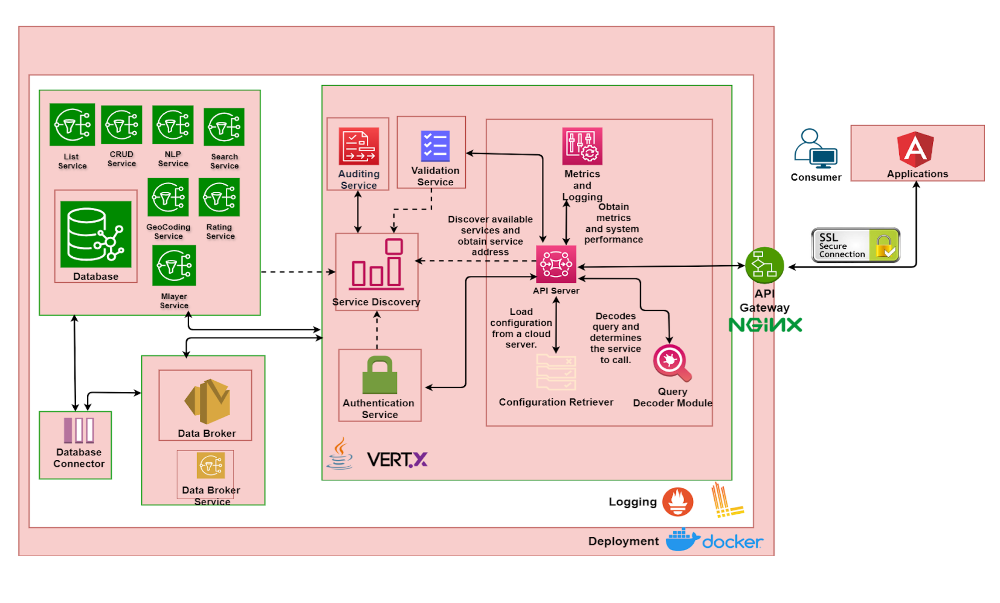

## Solution Architecture
The following block diagram shows different components/services used in implementing the DX 
Catalogue Server.

The above setup allows specific high load containers/services to scale with ease. Various services of the server are detailed in the sections below.

### API Server
An API server is an HTTPS Web Server and serves as an API gateway for actors (consumers, providers, DX AAA Server) to interact with the different services provided by the DX Catalogue Server.
These services (as described below) may be database read/write services.
It is also responsible for calling the Authorization Server (via the authorization service) to authenticate and authorize access to resources.

### Database Discovery Service
The Database Discovery Service is called by the API Server to serve consumer dataset discovery requests. Either the document itself, a count of all matching documents or a list of IDs of matching documents may be returned by this service depending on the query made.
A number of discovery queries are supported including -
Attribute search - searches and retrieves data based on attribute or key-value pairs whose values maybe text or numeric attributes (such as name, tags, etc)
Geo-Spatial search - searches and retrieves datasets based on geo-spatial queries which may be a circle, a bounding box, a polygon or a line string
Text search -  searches and retrieves datasets based on a free text search
Complex search - searches and retrieves datasets based on a combination of an attribute search, a geo-spatial search and a text search
List - lists all items of a particular type (resource, resourceGroup, resourceServer, provider)
Responses from these queries may additionally be filtered out to make the data more manageable using filters on the attributes contained in the data.

### Auditing Service
The Data Broker is used by the API Server to log information related to successful creation, deletion of policies and successful creation, updation, and deletion of access requests.

### Authentication Service
The authentication service interacts with the DX AAA Server to validate tokens provided by a consumer of a protected resource and to fetch information about the user.

### Validation Service
The validation service is utilized by the API server to ensure the schema of the request body is correct. During CRUD operations, it also checks whether the necessary components for creating an item are available.

### NLP Service
Natural Language Processing API is used a for a text based search to discover resources and resource groups on the catalogue server

### GeoCoding Service
The geocoding feature uses Pelias to generate a geo-summary by converting location-based search queries into geographic coordinates. It identifies matching geolocations and ranks them based on confidence scores, ensuring the most accurate results for places or addresses. This enhances search accuracy and relevance for users.

### Rating Service
It is a Consumer Specific API that allows consumer to provide a rating for a resource item only if they have queried the resource from the DX Resource Server a minimum number of times.

