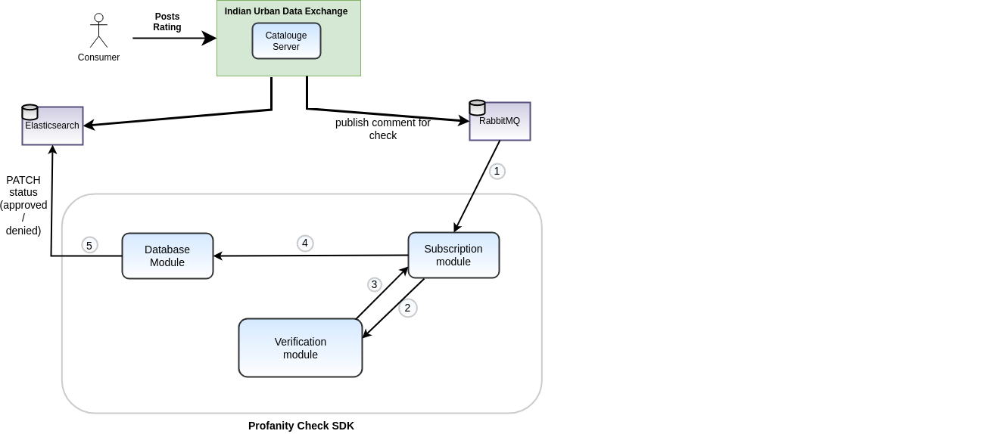

# IUDX Profanity Check SDK

The IUDX Profanity Check SDK ensures that a comment/review associated with a user rating doesn't contain any foul language or indecent words.
It provides a flow to auto accept or reject comments by using a machine learning model called `cuss-inspect`



## Installing Python
* For running the IUDX Profanity Check SDK, Python is required which can be installed by following [this](https://cloud.google.com/python/docs/setup#installing_python) guide.

### Setting Environment
* After successfully installing python make sure that the environment contains path to your project if not then it should be done by running the following command in the command prompt :
 ```commandline
# For Linux
$ export PYTHONPATH="${PYTHONPATH}:/path/to/your/project/"
# For Windows
$ set PYTHONPATH=%PYTHONPATH%;C:\path\to\your\project\
# For MacOS
$ PYTHONPATH="/path/to/your/project/:$PYTHONPATH"
$ export PYTHONPATH
```
* Define the appropriate config options in file named ``config.json``. Please see the 
  [example file](example-config.json) to get idea.
* Now the project is ready to run, it can be done by running the following command in the command prompt :

### Running Project
```commandline
$ python3 main.py
```

### Docker based
1. Install docker and docker-compose
2. Clone this repo
3. Build the docker image
```
 docker build -t ghcr.io/datakaveri/profanity-check-sdk:4.0.0-5 -f Dockerfile .
```
4. Modify the `docker-compose.yaml` file to map the config file you just created
5. Bring up the profanity-check sdk using following command:
```
docker-compose up -d 
```

